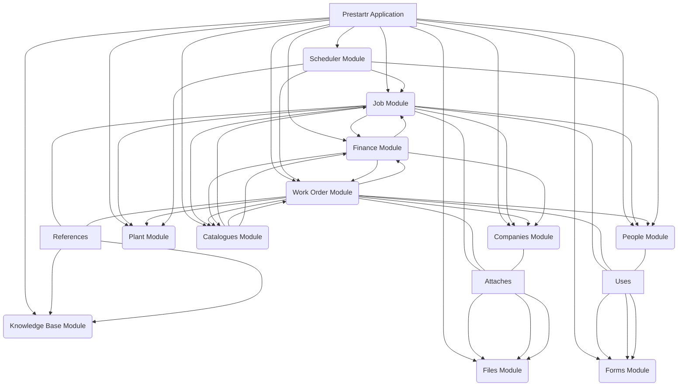
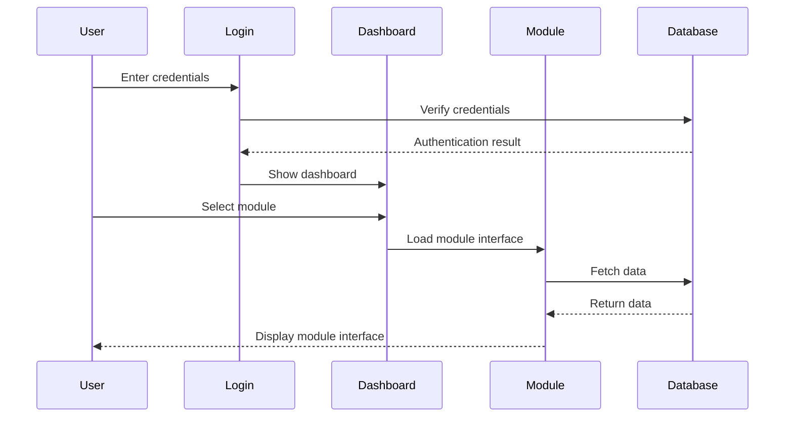
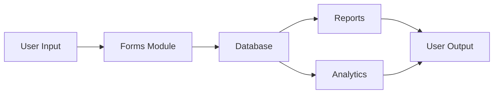
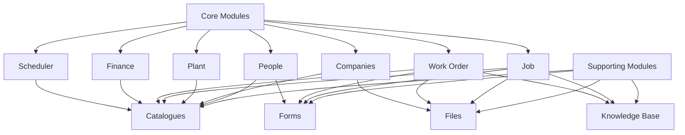

# Prestartr User Documentation

## Table of Contents

1. [Introduction](#introduction)
2. [System Overview](#system-overview)
3. [Module Descriptions](#module-descriptions)
4. [Getting Started](#getting-started)
5. [Core Workflows](#core-workflows)
6. [Diagrams](#diagrams)

## Introduction

Prestartr is a comprehensive enterprise management system designed to streamline operations across various business functions. This documentation is designed for users with no prior knowledge of the system.

## System Overview

Prestartr is a modular system that integrates various business functions into a cohesive platform. The system is built around core modules that work together to manage different aspects of business operations.

## Module Descriptions

### Core Modules

1. **People Module**
   - Manages employee information
   - Handles user roles and permissions
   - Tracks employee-related documentation

2. **Companies Module**
   - Manages client and vendor information
   - Handles company-related documentation
   - Tracks business relationships

3. **Plant Module**
   - Manages physical assets and locations
   - Tracks equipment and facilities
   - Handles maintenance schedules

4. **Job Module**
   - Creates and manages job records
   - Tracks job progress and status
   - Integrates with other modules for resource allocation

5. **Work Order Module**
   - Generates and tracks work orders
   - Manages work order lifecycle
   - Integrates with scheduling and finance

6. **Finance Module**
   - Handles financial transactions
   - Manages billing and invoicing
   - Tracks costs and revenue

7. **Scheduler Module**
   - Manages resource scheduling
   - Coordinates between jobs and work orders
   - Handles calendar and timeline management

### Supporting Modules

8. **Catalogues Module**
   - Maintains product and service catalogs
   - Manages inventory items
   - Tracks pricing and specifications

9. **Forms Module**
   - Provides customizable forms
   - Handles data collection
   - Supports various business processes

10. **Files Module**
    - Manages document storage
    - Handles file attachments
    - Supports version control

11. **Knowledge Base Module**
    - Stores organizational knowledge
    - Provides documentation
    - Supports training and reference

## Getting Started

### Login Process
1. Navigate to https://app.prestartr.com/login
2. Enter your username and password
3. Click the login button

### First-Time Setup
1. Complete your profile information
2. Set up your preferences
3. Review system notifications

## Core Workflows

### Job Management Workflow
1. Create a new job
2. Assign resources
3. Track progress
4. Complete and review

### Work Order Workflow
1. Generate work order
2. Assign personnel
3. Track completion
4. Close and document

## Diagrams

### System Architecture Diagram

### User Interaction Flow

### Data Flow Diagram

### Module Dependencies

## Best Practices

1. **Data Entry**
   - Always verify information before submission
   - Use standardized formats
   - Complete all required fields

2. **Document Management**
   - Keep files organized
   - Use appropriate naming conventions
   - Maintain version control

3. **Security**
   - Keep passwords secure
   - Log out when not in use
   - Report suspicious activity

## Troubleshooting

### Common Issues

1. Login problems
2. Slow performance
3. Missing data
4. Error messages

### Solutions

1. Clear browser cache
2. Check internet connection
3. Contact system administrator
4. Review error logs

## Support

For additional support:

- Contact your system administrator
- Refer to the Knowledge Base
- Submit a support ticket
