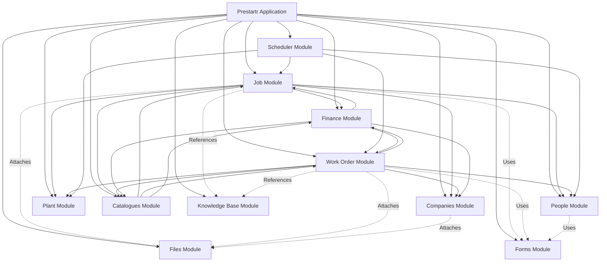
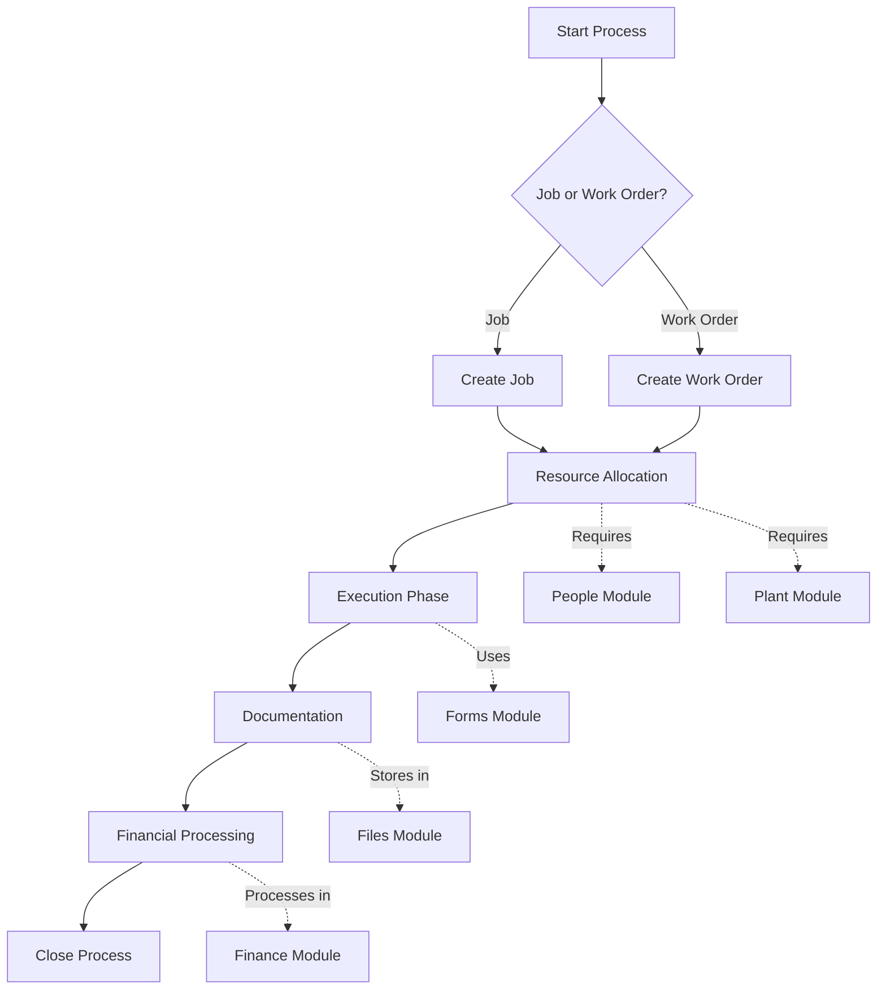
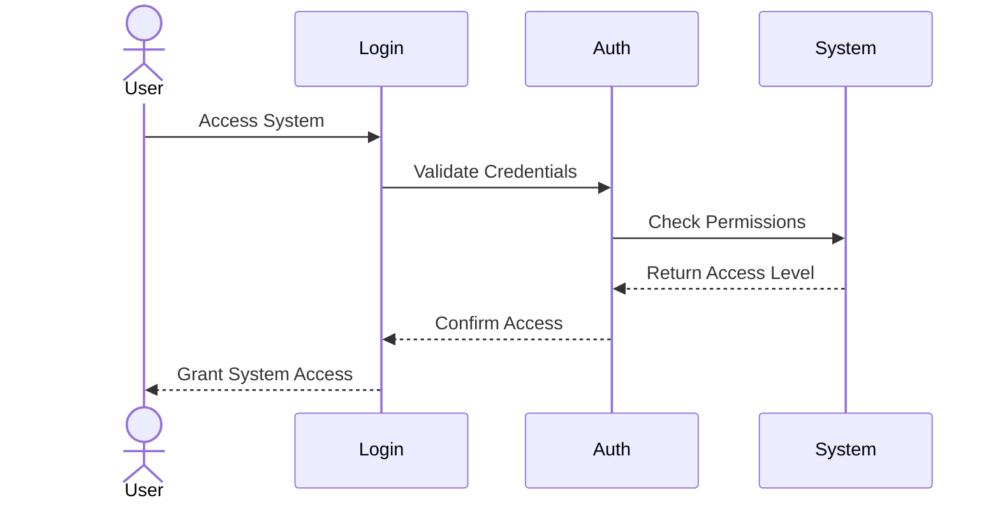
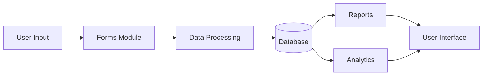

# Prestartr System Documentation

## Overview

Welcome to the documentation for the Prestartr system!

Prestartr appears to be a web-based software system designed to help manage operational work involving coordination between people, equipment, clients, and finances. Its main goal is to organize and track work, manage the necessary resources (like staff and machinery), handle scheduling, keep track of costs, and manage relationships with external companies.

This documentation aims to provide a clear understanding of the system's different modules and how they work together.

## System Architecture Diagram

The following diagram shows the high-level relationship between the core modules identified in the Prestartr system:

## Module Interactions

### Core Business Process Flow

### User Authentication Flow

### Data Flow

## Legend

### Node Types
- Core Modules: Main system components
- Supporting Modules: Additional functionality
- Integration Points: Connection points between modules

### Connection Types
--> Direct dependency
-.- Optional dependency
--- Bidirectional interaction

For detailed documentation about each module, please refer to the specific module documentation files.