# Prestartr System Documentation

## Overview

Welcome to the Prestartr system documentation! Prestartr is a comprehensive enterprise management system designed to streamline operations across various business functions. It integrates multiple modules to manage people, equipment, clients, finances, and more, providing a cohesive platform for efficient business operations.

## Table of Contents

1. [System Overview](#system-overview)
2. [Module Descriptions](#module-descriptions)
3. [Getting Started](#getting-started)
4. [Core Workflows](#core-workflows)
5. [Diagrams](#diagrams)
6. [Best Practices](#best-practices)
7. [Troubleshooting](#troubleshooting)
8. [Support](#support)

## System Overview

Prestartr is built around core and supporting modules that work together to manage different aspects of business operations. Below is a mindmap of the system's structure:

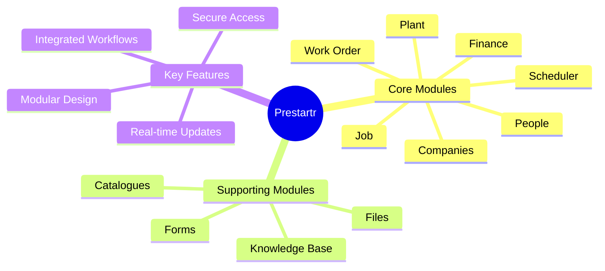

## Module Descriptions

### Core Modules

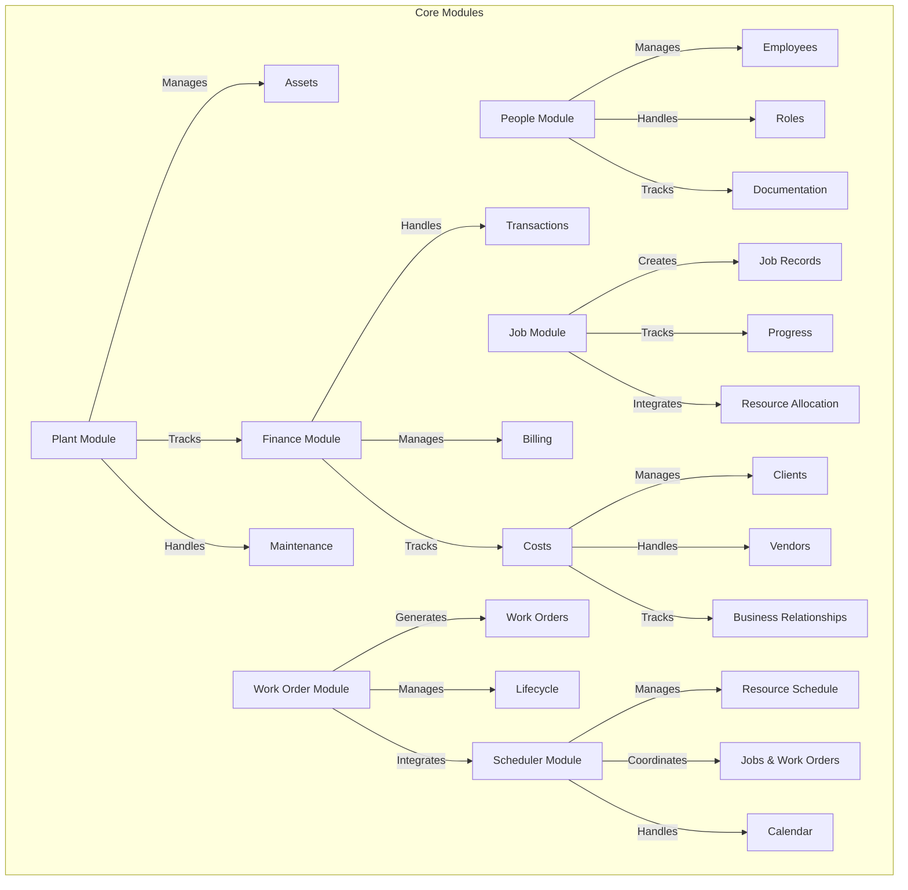

### Supporting Modules

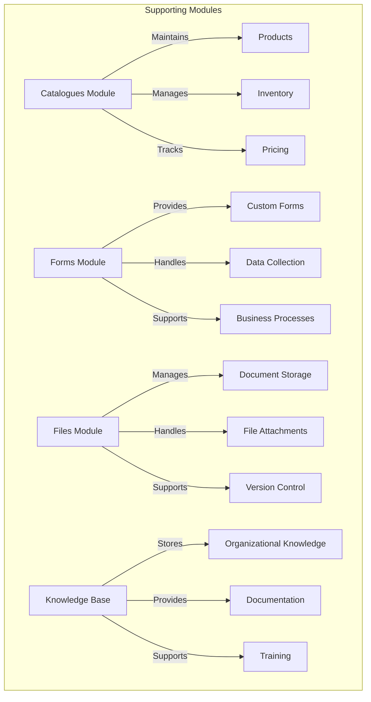

## Getting Started

### Login Process

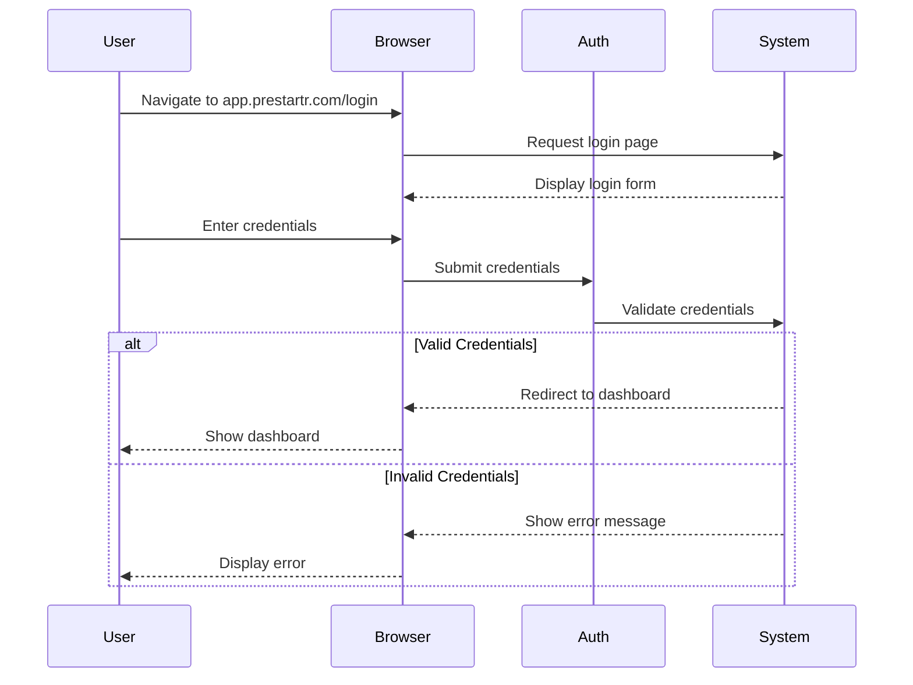

## Core Workflows

### Job Management Workflow

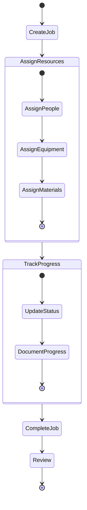

### Work Order Workflow

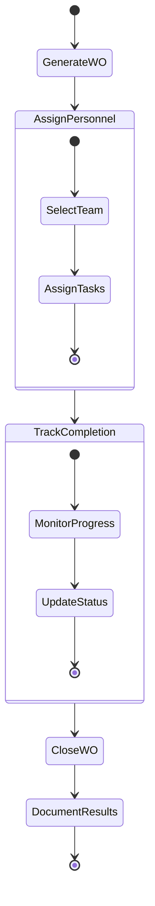

## Diagrams

### System Architecture

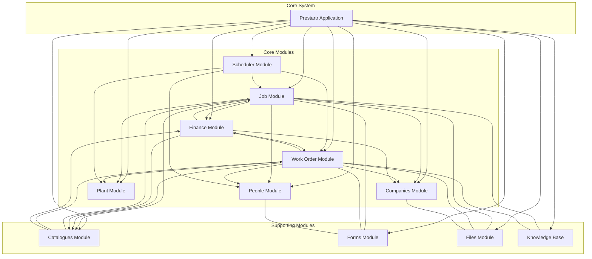

### Data Flow

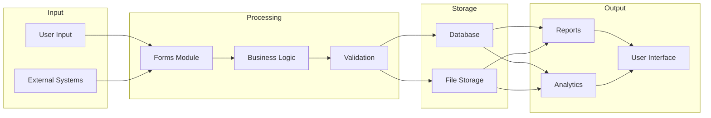

## Best Practices

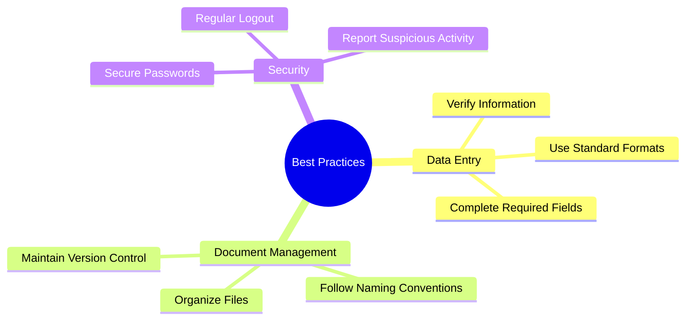

## Troubleshooting

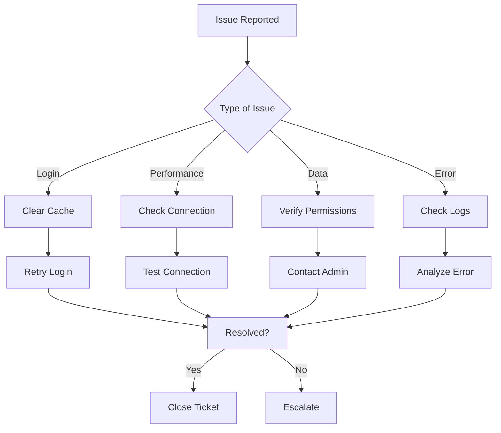

## Support

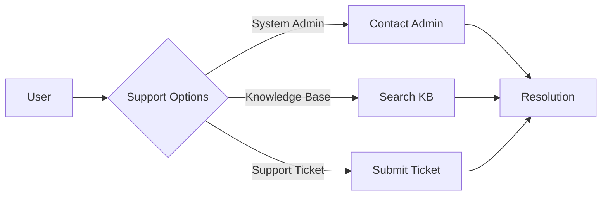

For detailed information about each module and its functionality, please refer to the specific module documentation.
